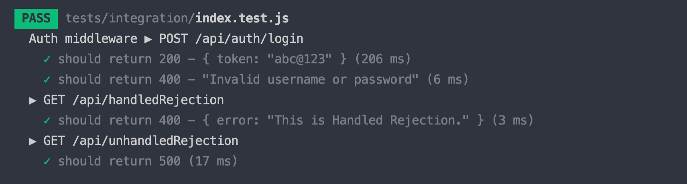

1. Write your own error handler middleware at "src/middlewares/errorHandler.js":

- return error statusCode with message in json format: { error: <Error_Message> }

2. Create your local authentication strategy (https://www.npmjs.com/package/passport-local) at "src/services/passport.js" to authenticates users using a email and password:

- Logged in user and return {token: <Some_Token>} if email is "admin@admin.com" and password is "password"

3. Write your passport-local middleware at "src/middlewares/passportLocal.js" to apply on "/api/auth/login" route

=> After correctly finish three tasks above then run "npm test" you can see green checks only. Good luck!

  
